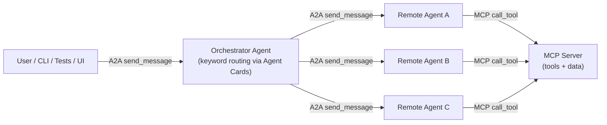

# A2A + MCP Workshop

> Build production-ready multi-agent systems from scratch — two complete, runnable use cases wired with the A2A protocol and MCP.


This workshop teaches you how to design and wire a multi-agent system where agents communicate over the **A2A protocol** and access tools through **MCP**. You get two fully working use cases, each with its own agents, MCP server, tests, and a one-command start script.

---

## How It Works

Every system in this repo follows the same pattern: a user message reaches an **Orchestrator**, which reads each agent's **Agent Card**, scores keyword matches, and forwards the request to the right specialist **Remote Agent**. That agent calls tools on the **MCP Server** and streams back a response.



See [`docs/architecture.md`](docs/architecture.md) for detailed sequence diagrams and internal agent anatomy.

---

## Use Cases

### 1. [Travel Activity Planner](use_cases/travel_activity_planner/)

A trip-planning assistant. Ask about weather, activities, packing, or local tips — the orchestrator routes to the right specialist agent.

| Component | Port | Description |
|-----------|------|-------------|
| MCP Server | 8003 | Weather, activities, local tips tools |
| Orchestrator Agent | 8080 | Keyword-score routing to 3 agents |
| Packing List Agent | 8081 | LLM — packing lists and trip invitations |
| Weather & Activity Agent | 8082 | LLM + MCP agentic loop (live Open-Meteo data) |
| Local Tips Agent | 8083 | Rule-based — city tips from local JSON |
| Streamlit UI (optional) | 8504 | Direct MCP tool playground |

> **Prerequisites:** Python 3.11+, Azure OpenAI credentials, internet access (Open-Meteo + Nominatim geocoding).

```powershell
cd use_cases/travel_activity_planner
pip install -e .
cp .env.example .env    # add Azure OpenAI credentials
.\start_all.ps1
```

[Full README](use_cases/travel_activity_planner/README.md) · [Architecture](use_cases/travel_activity_planner/docs/architecture.md) · [Troubleshooting](use_cases/travel_activity_planner/docs/troubleshooting.md)

---

### 2. [Personalized Learning](use_cases/personalized_learning/)

An offline learning assistant. Explain topics, run quizzes, track progress, and build personalized study plans — no API key required for the agents.

| Component | Port | Description |
|-----------|------|-------------|
| MCP Server | 8004 | 8 learning + career tools, 100% offline JSON |
| Learning Orchestrator | 8090 | LLM keyword routing to 3 agents |
| Topic Explainer Agent | 8091 | Rule-based — explains topics at beginner/intermediate/advanced |
| Assessment Agent | 8092 | Rule-based — quizzes, scores, level-up logic |
| Study Plan Agent | 8093 | Rule-based — personalized study and career gap plans |
| Streamlit UI (optional) | 8504 | Direct MCP tool playground |

> **No API key required for agents.** Only the Orchestrator uses Azure OpenAI. All three remote agents and every MCP test run 100% offline.

```powershell
cd use_cases/personalized_learning
pip install -e .
cp .env.example .env    # only needed to run the Orchestrator
.\start_all.ps1
```

[Full README](use_cases/personalized_learning/README.md) · [Architecture](use_cases/personalized_learning/docs/architecture.md) · [Exercises](use_cases/personalized_learning/docs/exercises.md) · [Extending](use_cases/personalized_learning/docs/extending.md)

**Google Colab:** open [`workshop_colab.ipynb`](use_cases/personalized_learning/workshop_colab.ipynb) — no local setup required.

---

## Concepts at a Glance

New to A2A or MCP? Here is what every term means and where to find it in the code.

| Term | What it is | Where in the code |
|------|-----------|-------------------|
| **A2A Protocol** | HTTP-based protocol for agents to send tasks to each other and stream back responses | [`a2a-sdk` docs](https://google.github.io/A2A/) |
| **MCP** | Structured way for agents to call named tools on a server, instead of raw API calls | [`mcp/fastmcp_server.py`](use_cases/travel_activity_planner/mcp/fastmcp_server.py) |
| **Agent Card** | A JSON descriptor at `/.well-known/agent-card.json` — declares an agent's name, skills, and routing tags | `a2a_agents/*/agent_card.py` |
| **Orchestrator** | The entry-point agent; loads all Agent Cards, scores keyword matches, forwards to the best agent | `a2a_agents/orchestrator_agent/agent_logic.py` |
| **Remote Agent** | A specialist agent that handles one domain (weather, packing, learning topics, etc.) | `a2a_agents/remote_agents/*/agent_logic.py` |
| **Skill** | A named capability declared in an Agent Card (e.g. `weather_forecast`) — used for routing | `a2a_agents/*/agent_card.py` |
| **Tool** | A callable function exposed by an MCP server (e.g. `get_weather_for_location_and_date_string`) | `mcp/fastmcp_server.py` |
| **Context ID** | A UUID that links all messages in one conversation so agents can remember previous turns | `a2a_agents/base_executor.py` |
| **Task** | The A2A unit of work: a user message + conversation history + streaming response | `a2a_agents/base_executor.py` |
| **BaseAgentExecutor** | Shared class that converts incoming A2A tasks into calls to `AgentLogic.stream()` | `a2a_agents/base_executor.py` |

See [`docs/glossary.md`](docs/glossary.md) for the full glossary with analogies and code examples.

---

## Quick Start

```powershell
# 1. Clone the repo
git clone <repo-url>
cd a2a_mcp_workshop

# 2. Choose a use case
cd use_cases/personalized_learning   # no API key needed
# or
cd use_cases/travel_activity_planner # requires Azure OpenAI + internet

# 3. Install
pip install -e .

# 4. Configure environment
cp .env.example .env
# Edit .env with your Azure OpenAI credentials (travel: required; learning: Orchestrator only)

# 5. Start all services
.\start_all.ps1          # MCP server + all agents
.\start_all.ps1 -UI      # also opens Streamlit MCP Playground on :8504
.\start_all.ps1 -Stop    # stop everything

# 6. Run tests
python tests/run_all_tests.py --skip-agents   # fast: MCP only, no agents needed
python tests/run_all_tests.py                 # full suite (all services must be running)
```

See [`docs/quickstart.md`](docs/quickstart.md) for a detailed walkthrough including health checks and the interactive CLI client.

---

## Project Layout

```
a2a_mcp_workshop/
├── docs/                              # Shared documentation
│   ├── glossary.md                    # A2A + MCP terminology guide
│   ├── architecture.md                # System-wide Mermaid diagrams
│   └── quickstart.md                  # Step-by-step setup guide
│
└── use_cases/
    ├── travel_activity_planner/       # LLM agents + live weather API
    │   ├── a2a_agents/                # Orchestrator + 3 remote agents
    │   ├── mcp/                       # FastMCP server + tools + local data
    │   ├── tests/                     # MCP, agent, multi-turn test suites
    │   ├── ui/                        # Streamlit MCP Playground
    │   ├── docs/                      # Architecture + troubleshooting
    │   ├── start_all.ps1              # One-command startup
    │   └── pyproject.toml
    │
    └── personalized_learning/         # 100% offline — no API key for agents
        ├── a2a_agents/                # Orchestrator + 3 rule-based remote agents
        ├── mcp/                       # FastMCP server + 8 tools + local JSON data
        ├── tests/                     # MCP, agent, memory, e2e test suites
        ├── ui/                        # Streamlit MCP Playground
        ├── docs/                      # Architecture, exercises, extending, troubleshooting
        ├── workshop_colab.ipynb       # Google Colab entry point
        ├── start_all.ps1              # One-command startup
        └── pyproject.toml
```

---

## Documentation

| Document | Description |
|----------|-------------|
| [`docs/glossary.md`](docs/glossary.md) | Plain-language guide to every A2A and MCP term |
| [`docs/architecture.md`](docs/architecture.md) | System-wide Mermaid diagrams: component model, message flow, agent anatomy |
| [`docs/quickstart.md`](docs/quickstart.md) | Full step-by-step setup for both use cases |
| [`use_cases/travel_activity_planner/docs/architecture.md`](use_cases/travel_activity_planner/docs/architecture.md) | Travel use case component map + ports |
| [`use_cases/travel_activity_planner/docs/troubleshooting.md`](use_cases/travel_activity_planner/docs/troubleshooting.md) | Travel-specific troubleshooting |
| [`use_cases/personalized_learning/docs/architecture.md`](use_cases/personalized_learning/docs/architecture.md) | Learning use case component map + flows |
| [`use_cases/personalized_learning/docs/exercises.md`](use_cases/personalized_learning/docs/exercises.md) | Workshop exercises |
| [`use_cases/personalized_learning/docs/extending.md`](use_cases/personalized_learning/docs/extending.md) | How to add topics, agents, and tools |
| [`use_cases/personalized_learning/docs/troubleshooting.md`](use_cases/personalized_learning/docs/troubleshooting.md) | Learning-specific troubleshooting |

---

## Testing

```powershell
# Fast path — MCP tools only, no agents or API key needed
python tests/run_all_tests.py --skip-agents

# Full suite — all services must be running
python tests/run_all_tests.py --verbose

# Individual groups (learning use case example)
python tests/run_all_tests.py --only mcp
python tests/run_all_tests.py --only topic
python tests/run_all_tests.py --only e2e
```
