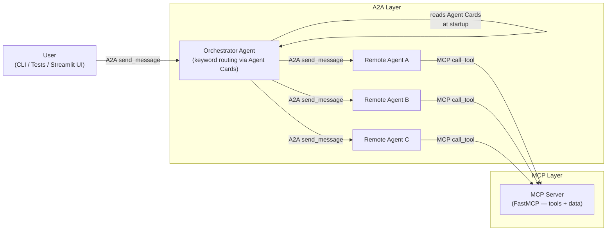
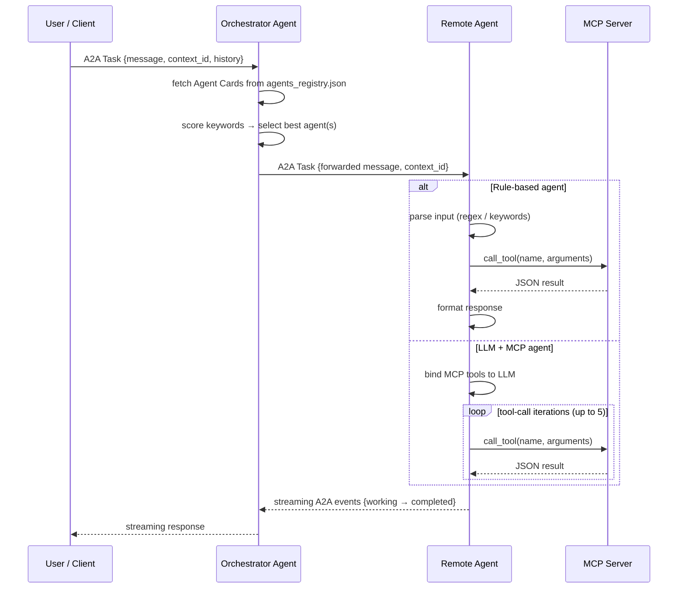
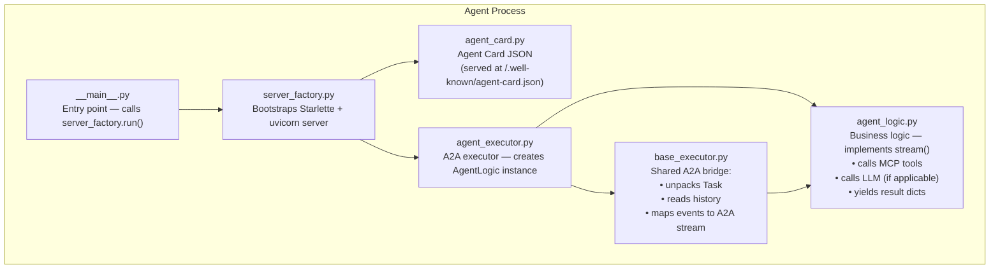
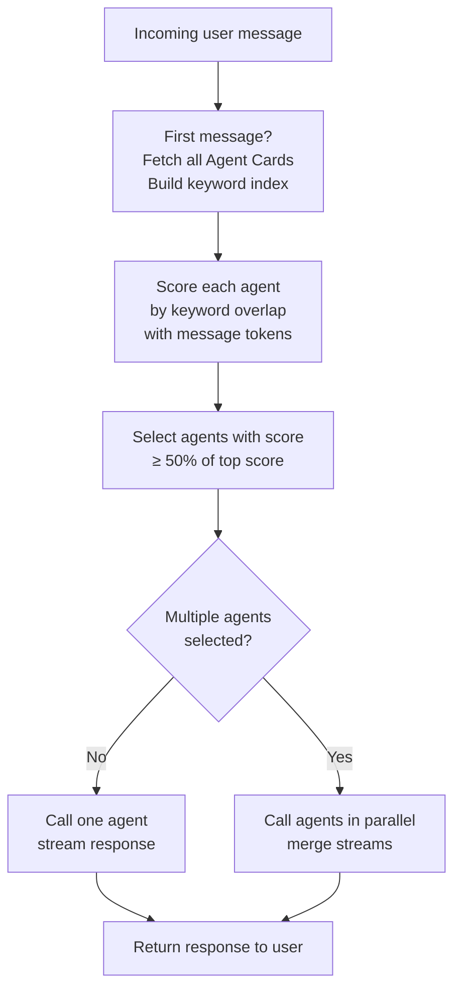

# System Architecture

This document covers the architecture shared by both use cases, with three levels of detail:
1. High-level component model
2. Message flow for a single request
3. Internal anatomy of a single agent

For use-case-specific diagrams see:
- [Travel Activity Planner — Architecture](../use_cases/travel_activity_planner/docs/architecture.md)
- [Personalized Learning — Architecture](../use_cases/personalized_learning/docs/architecture.md)

---

## 1. High-Level Component Model

Every system in this repo follows the same pattern regardless of use case.

**A2A layer** — agents communicate over HTTP using the A2A protocol. Each agent is a separate process with its own port.  
**MCP layer** — the MCP server is a single FastMCP process. Agents call it to access tools and data.

---

## 2. Message Flow — Single Request

What happens from the moment a user sends a message to the moment they receive a response.

**context_id** — forwarded at every step so all agents share the same conversation session. This is how multi-turn memory works.

---

## 3. Internal Anatomy of an Agent

Every agent (Orchestrator or Remote) is structured the same way internally.

**What you implement** when adding a new agent: only `agent_card.py` and `agent_logic.py`. Everything else is shared infrastructure.

---

## 4. Orchestrator Routing Logic

The 50% threshold intentionally allows multi-agent responses for queries that span domains (e.g. "What should I pack and what is the weather like?").

---

## 5. Port Reference

### Travel Activity Planner

| Service | Port | File |
|---------|------|------|
| MCP Server | 8003 | `mcp/fastmcp_server.py` |
| Orchestrator Agent | 8080 | `a2a_agents/orchestrator_agent/__main__.py` |
| Packing List Agent | 8081 | `a2a_agents/remote_agents/packing_list_agent/__main__.py` |
| Weather & Activity Agent | 8082 | `a2a_agents/remote_agents/weather_activity_agent/__main__.py` |
| Local Tips Agent | 8083 | `a2a_agents/remote_agents/local_tips_agent/__main__.py` |
| Streamlit UI (optional) | 8504 | `ui/mcp_playground.py` |

### Personalized Learning

| Service | Port | File |
|---------|------|------|
| MCP Server | 8004 | `mcp/fastmcp_server.py` |
| Learning Orchestrator | 8090 | `a2a_agents/orchestrator_agent/__main__.py` |
| Topic Explainer Agent | 8091 | `a2a_agents/remote_agents/topic_explainer_agent/__main__.py` |
| Assessment Agent | 8092 | `a2a_agents/remote_agents/assessment_agent/__main__.py` |
| Study Plan Agent | 8093 | `a2a_agents/remote_agents/study_plan_agent/__main__.py` |
| Streamlit UI (optional) | 8504 | `ui/mcp_playground.py` |
