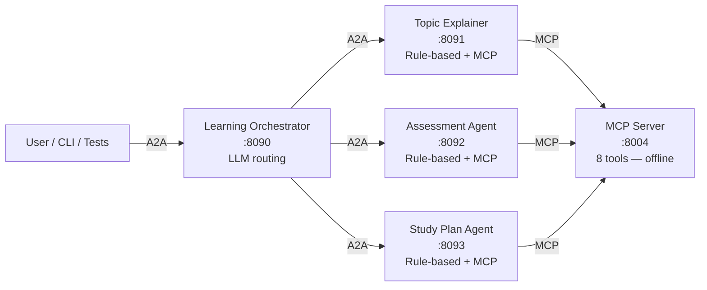

# Personalized Learning

An offline learning assistant built with the **A2A protocol** (agent-to-agent communication) and **MCP** (Model Context Protocol) for tool access.

> **No API key required for agents.** Only the Orchestrator uses Azure OpenAI. All three remote agents and every MCP test run 100% offline.

---

## How It Works

A user asks about a learning topic. The Orchestrator reads each agent's **Agent Card**, scores keyword matches, and routes the request to the right specialist. Agents call the MCP Server to access topics, quizzes, study paths, and career data — all from local JSON files.



---

## Services

| Service | Port | LLM? | Description |
|---------|------|------|-------------|
| MCP Server | 8004 | No | 8 learning + career tools, 100% offline JSON |
| Learning Orchestrator | 8090 | Yes (Azure OpenAI) | Keyword routing to 3 agents |
| Topic Explainer Agent | 8091 | No | Explains topics at beginner/intermediate/advanced |
| Assessment Agent | 8092 | No | Quizzes, scores, level-up logic |
| Study Plan Agent | 8093 | No | Personalized study and career gap plans |
| Streamlit UI (optional) | 8504 | No | Direct MCP tool playground |

---

## Quick Start

```powershell
# Install
cd use_cases/personalized_learning
pip install -e .

# Configure (only needed to run the Orchestrator)
cp .env.example .env

# Start all services
.\start_all.ps1

# Start with Streamlit MCP Playground
.\start_all.ps1 -UI

# Stop everything
.\start_all.ps1 -Stop
```

**Google Colab:** open [`workshop_colab.ipynb`](workshop_colab.ipynb) — no local setup required.

---

## Environment Variables

The `.env` file is only required to run the **Orchestrator Agent**. All remote agents and MCP tests work without it.

```env
AZURE_OPENAI_ENDPOINT=https://YOUR_RESOURCE.openai.azure.com
AZURE_OPENAI_DEPLOYMENT_NAME=gpt-4o
AZURE_OPENAI_API_VERSION=2024-02-01
OPENAI_API_KEY=your-api-key-here
MCP_SERVER_URL=http://127.0.0.1:8004/mcp
```

---

## MCP Tools

All tools are offline and return `"data_source": "local_json"`.

| Tool | Tags | Description |
|------|------|-------------|
| `get_topic_summary` | topic, explanation | Topic summary at a given level |
| `get_assessment_questions_by_topic` | assessment, quiz | Quiz questions for a topic and level |
| `get_learning_state` | assessment, state | User's current level and history |
| `update_learning_state` | assessment, state | Record score; ≥75% advances level |
| `get_study_path` | study, plan | Ordered study plan for topic/level/time |
| `get_job_description` | career, job | Job requirements and required skills |
| `get_resume_profile` | career, resume | Candidate skills and experience |
| `get_skill_gap_analysis` | career, gap | Gap between job requirements and candidate |

**Topics:** `mcp`, `a2a`, `rag`, `prompt_engineering`, `python_async`  
**Levels:** `beginner`, `intermediate`, `advanced`  
**Time slots:** `30_minutes`, `2_hours`, `1_day`  
**Jobs:** `ai_engineer`, `data_scientist`, `backend_engineer`  
**Candidates:** `candidate_1`, `candidate_2`

---

## Example Prompts

### Topic Explanation
```
Explain MCP for a beginner.
Explain A2A for an intermediate developer.
Give me an advanced overview of prompt engineering.
```

### Assessment
```
Give me a short quiz for MCP.
I got 3 out of 4 correct.
What is my current MCP level?
```

### Study Plan
```
Build me a 2-hour study plan for MCP.
I have 30 minutes. What should I study for RAG?
Give me a 1-day plan for prompt engineering.
```

### Career Learning
```
Prepare a learning plan for candidate_1 for the AI Engineer role.
What skills does candidate_2 need for data_scientist?
```

### Full Learning Flow
```
I want to learn MCP. Assess my level and build me a 2-hour study plan.
```

---

## Running Tests

```powershell
# Fast: MCP tools only (no API key needed)
python tests/run_all_tests.py --skip-agents

# Full suite (all services must be running)
python tests/run_all_tests.py

# Individual groups
python tests/run_all_tests.py --only mcp
python tests/run_all_tests.py --only topic
python tests/run_all_tests.py --only assessment
python tests/run_all_tests.py --only study
python tests/run_all_tests.py --only e2e
python tests/run_all_tests.py --only memory

# Verbose output
python tests/run_all_tests.py --verbose
```

---

## Interactive Client

```powershell
python a2a_agents/client.py
```

---

## Project Structure

```
personalized_learning/
├── a2a_agents/
│   ├── base_executor.py              # Shared A2A executor with history forwarding
│   ├── server_factory.py             # Starlette/uvicorn bootstrap
│   ├── client.py                     # Interactive CLI client
│   ├── orchestrator_agent/           # LLM keyword router (port 8090)
│   │   ├── agent_card.py
│   │   ├── agent_logic.py            # Routing: load cards → score → forward
│   │   ├── agent_executor.py
│   │   ├── agents_registry.json      # Remote agent URLs
│   │   └── __main__.py
│   └── remote_agents/
│       ├── topic_explainer_agent/    # port 8091 — rule-based, no LLM
│       ├── assessment_agent/         # port 8092 — rule-based, no LLM
│       └── study_plan_agent/         # port 8093 — rule-based, no LLM
├── mcp/
│   ├── fastmcp_server.py             # 8 MCP tools (port 8004)
│   ├── fastmcp_client.py             # Demo client
│   └── data/
│       ├── learning/                 # topics, questions, study_paths, user state
│       └── career/                   # jobs, resumes, skill map
├── tests/
│   ├── test_mcp.py
│   ├── test_agents.py
│   ├── test_memory.py
│   ├── test_e2e.py
│   └── run_all_tests.py
├── ui/
│   └── mcp_playground.py             # Streamlit UI (port 8504)
├── docs/
│   ├── architecture.md               # Component diagrams + data flows
│   ├── exercises.md                  # Workshop exercises
│   ├── extending.md                  # How to add topics, agents, tools
│   └── troubleshooting.md            # Common issues and fixes
├── MULTI_TURN_GUIDE.md               # Step-by-step multi-turn exercise
├── workshop_colab.ipynb              # Google Colab entry point
├── start_all.ps1
├── pyproject.toml
└── .env.example
```

---

## Documentation

| Document | Description |
|----------|-------------|
| [Architecture](docs/architecture.md) | Component diagrams, data flows, file map |
| [Exercises](docs/exercises.md) | Workshop exercises |
| [Extending](docs/extending.md) | Add topics, agents, and MCP tools |
| [Troubleshooting](docs/troubleshooting.md) | Common issues and fixes |
| [Multi-Turn Guide](MULTI_TURN_GUIDE.md) | Enable conversation memory |
| [Glossary](../../docs/glossary.md) | A2A + MCP terminology guide |
| [System Architecture](../../docs/architecture.md) | System-wide diagrams |
