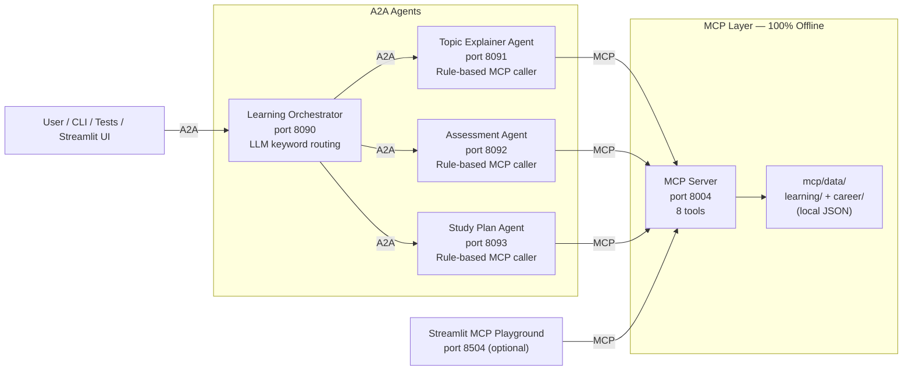
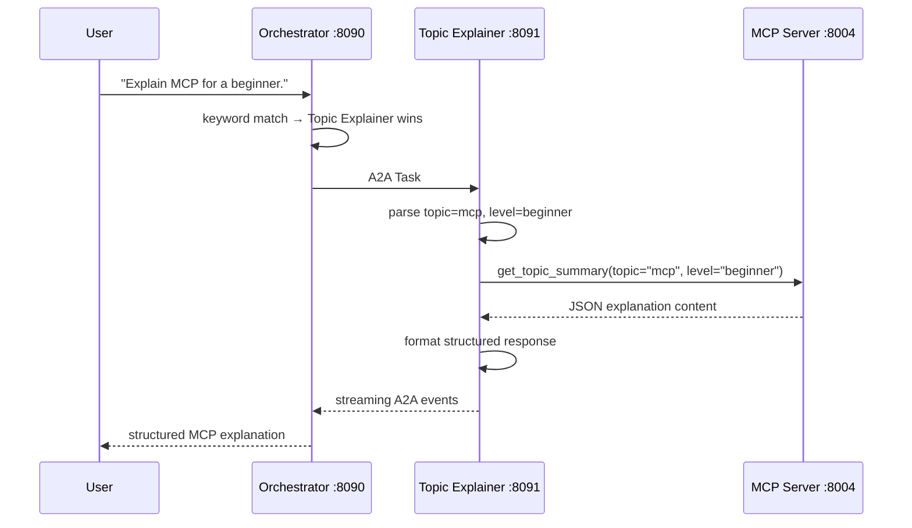
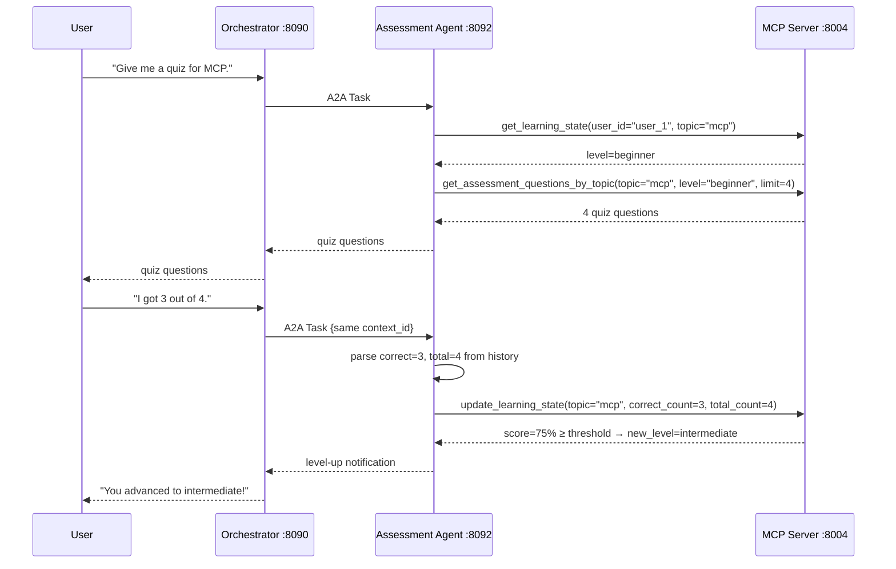
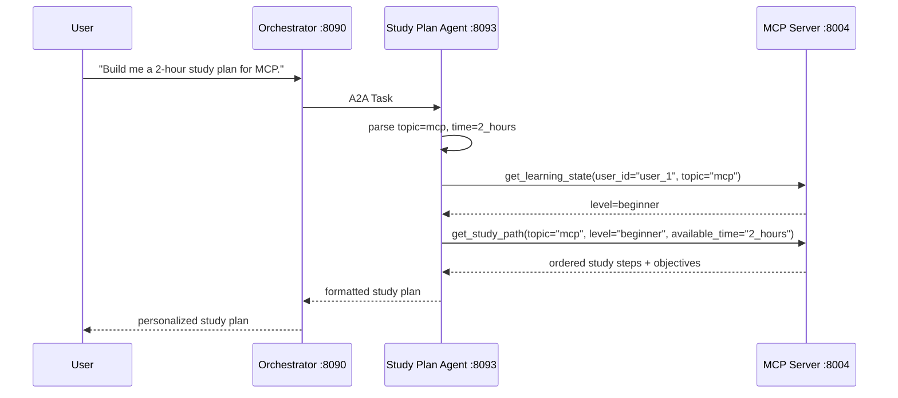
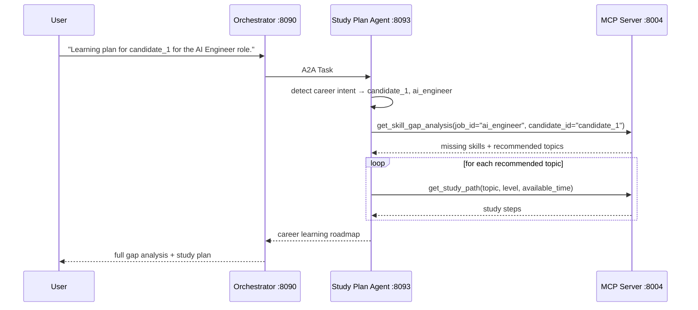

# Architecture — Personalized Learning

The Personalized Learning use case is a multi-agent system built on the A2A protocol with MCP tool access. It mirrors the architecture of the travel use case but applies the same patterns to a learning domain.

For system-wide architecture shared by both use cases, see [`docs/architecture.md`](../../../../docs/architecture.md).

---

## Component Overview

> **No LLM in remote agents.** Topic Explainer, Assessment, and Study Plan agents are 100% rule-based. They parse inputs with regex/keywords and call MCP tools directly — no Azure OpenAI calls.

---

## Components

### MCP Server (port 8004)

Built with FastMCP. Serves 8 tools, all offline, all reading from local JSON.

| Category | Tags | Tools |
|----------|------|-------|
| Topic knowledge | `topic`, `explanation` | `get_topic_summary` |
| Assessment | `assessment`, `quiz`, `state` | `get_assessment_questions_by_topic`, `get_learning_state`, `update_learning_state` |
| Study planning | `study`, `plan` | `get_study_path` |
| Career | `career`, `job`, `resume`, `gap` | `get_job_description`, `get_resume_profile`, `get_skill_gap_analysis` |

All responses include `"data_source": "local_json"`.

### Topic Explainer Agent (port 8091)

Rule-based. Parses topic and level from input, calls `get_topic_summary` via MCP, formats the result.

### Assessment Agent (port 8092)

Rule-based. Parses intent (quiz / score / level query) and calls the matching MCP tool:
- Quiz: `get_assessment_questions_by_topic`
- Score: `update_learning_state` — level advances when score ≥ 75%
- Level query: `get_learning_state`

### Study Plan Agent (port 8093)

Rule-based. Detects topic plan vs. career plan from input, chains the appropriate MCP calls.

### Learning Orchestrator (port 8090)

LLM-backed. On startup, fetches Agent Cards from all registered agents and builds a keyword index. Routes each message to agents whose score is within 50% of the top score (allows multi-agent responses).

---

## Data Flow

### Flow 1 — Topic Explanation

### Flow 2 — Assessment with Level-Up

### Flow 3 — Study Plan

### Flow 4 — Career Gap Analysis

### Flow 5 — Full Learning Flow (Multi-Agent)

When a message matches multiple agents (e.g. "Assess my level and build a study plan"), the Orchestrator calls both Assessment and Study Plan agents in parallel and merges their responses.

---

## Memory and Multi-Turn

All agents use the same pattern:

1. `base_executor.py` reads `context.current_task.history`.
2. Passes `history` to `agent.stream()`.
3. Each agent concatenates history as plain text for topic/intent extraction.
4. The Orchestrator forwards `context_id` to remote agents so they share the same conversation history.

See [`MULTI_TURN_GUIDE.md`](../MULTI_TURN_GUIDE.md) for the step-by-step workshop exercise.

---

## File Map

| Component | Directory | Key Files |
|-----------|-----------|-----------|
| Learning Orchestrator | `a2a_agents/orchestrator_agent/` | `agent_logic.py` — routing; `agents_registry.json` — remote URLs |
| Topic Explainer Agent | `a2a_agents/remote_agents/topic_explainer_agent/` | `agent_logic.py` — parse + MCP call |
| Assessment Agent | `a2a_agents/remote_agents/assessment_agent/` | `agent_logic.py` — intent + score parsing |
| Study Plan Agent | `a2a_agents/remote_agents/study_plan_agent/` | `agent_logic.py` — topic/career plans |
| MCP Server | `mcp/` | `fastmcp_server.py` — 8 tool definitions |
| Learning data | `mcp/data/learning/` | `topics.json`, `assessment_questions.json`, `study_paths.json`, `user_learning_state.json` |
| Career data | `mcp/data/career/` | `job_descriptions.json`, `sample_resumes.json`, `skill_map.json` |
| Shared infrastructure | `a2a_agents/` | `base_executor.py`, `server_factory.py`, `client.py` |
| Tests | `tests/` | `test_mcp.py`, `test_agents.py`, `test_memory.py`, `test_e2e.py` |
| UI | `ui/` | `mcp_playground.py` — Streamlit (port 8504) |

---

## Port Reference

| Service | Port |
|---------|------|
| MCP Server | 8004 |
| Learning Orchestrator | 8090 |
| Topic Explainer Agent | 8091 |
| Assessment Agent | 8092 |
| Study Plan Agent | 8093 |
| Streamlit MCP Playground | 8504 |
