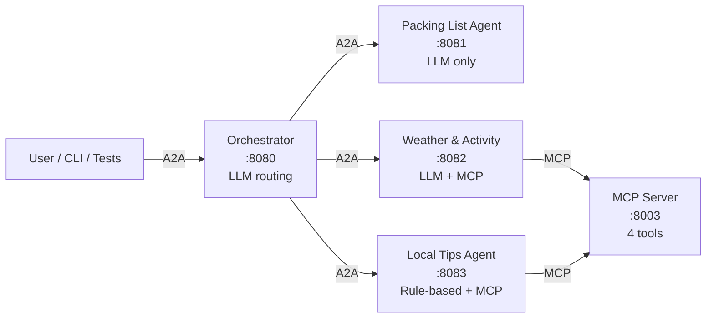

# Travel Activity Planner

A trip-planning multi-agent system built with the **A2A protocol** (agent-to-agent communication) and **MCP** (Model Context Protocol) for tool access.

> **Prerequisites:** Python 3.11+, Azure OpenAI credentials, internet access (Open-Meteo + Nominatim geocoding).

---

## How It Works

A user asks about a trip. The Orchestrator reads each agent's **Agent Card**, scores keyword matches, and routes the request to the right specialist. Agents call the MCP Server for live weather data and city tips.



---

## Services

| Service | Port | Description |
|---------|------|-------------|
| MCP Server | 8003 | Weather, activities, local tips tools |
| Orchestrator Agent | 8080 | Keyword-score routing to 3 agents |
| Packing List Agent | 8081 | LLM — packing lists and trip invitations |
| Weather & Activity Agent | 8082 | LLM + MCP agentic loop (live Open-Meteo data) |
| Local Tips Agent | 8083 | Rule-based — city tips from local JSON |
| Streamlit UI (optional) | 8504 | Direct MCP tool playground |

---

## Quick Start

```powershell
# Install
pip install -e .

# Configure
cp .env.example .env
# Edit .env with your Azure OpenAI credentials

# Start all services
.\start_all.ps1

# Start with Streamlit MCP Playground
.\start_all.ps1 -UI

# Stop everything
.\start_all.ps1 -Stop
```

---

## Environment Variables

```env
AZURE_OPENAI_ENDPOINT=https://YOUR_RESOURCE.openai.azure.com
AZURE_OPENAI_DEPLOYMENT_NAME=gpt-4o
AZURE_OPENAI_API_VERSION=2024-02-01
OPENAI_API_KEY=your-api-key-here
MCP_SERVER_URL=http://127.0.0.1:8003/mcp
```

---

## MCP Tools

| Tool | Tags | Description |
|------|------|-------------|
| `greet` | — | Demo greeting |
| `get_weather_for_location_and_date_string` | weather | Temperature + conditions for a location and date |
| `suggest_activities_for_location_and_date` | weather, activities | Weather-aware or preference-based activity suggestions |
| `get_local_tips_by_city` | local_tips | Restaurants, culture, transport tips per city |

Supported `trip_type` values: `general`, `family`, `beach`, `cultural`, `adventure`, `romantic`  
Supported cities: Tel Aviv, Paris, Barcelona, Rome, London

---

## Example Prompts

```
What is the weather in Paris next Friday?
What activities do you recommend in Barcelona in July for a family?
I am going to Rome for a week. What should I pack?
Give me local tips for Tel Aviv.
Plan a cultural trip to London — weather, packing, and tips.
```

---

## Running Tests

```powershell
# Fast: MCP tools only (no API key needed)
python tests/run_all_tests.py --skip-agents

# Full suite (all services must be running)
python tests/run_all_tests.py

# Individual groups
python tests/run_all_tests.py --only mcp
python tests/run_all_tests.py --only agents
python tests/run_all_tests.py --only local-tips

# Verbose output
python tests/run_all_tests.py --verbose
```

---

## Interactive Client

```powershell
python a2a_agents/client.py
```

---

## Project Structure

```
travel_activity_planner/
├── a2a_agents/
│   ├── base_executor.py              # Shared A2A executor with history forwarding
│   ├── server_factory.py             # Starlette/uvicorn bootstrap
│   ├── client.py                     # Interactive CLI client
│   ├── orchestrator_agent/           # Keyword-score router (port 8080)
│   │   ├── agent_card.py
│   │   ├── agent_logic.py            # Routing logic: load cards → score → forward
│   │   ├── agent_executor.py
│   │   ├── agents_registry.json      # Remote agent URLs
│   │   └── __main__.py
│   └── remote_agents/
│       ├── packing_list_agent/       # port 8081 — LLM only
│       ├── weather_activity_agent/   # port 8082 — LLM + MCP loop
│       └── local_tips_agent/         # port 8083 — rule-based MCP caller
├── mcp/
│   ├── fastmcp_server.py             # 4 MCP tools (port 8003)
│   ├── fastmcp_client.py             # Demo client
│   ├── mcp_utils.py                  # Weather parsing helpers
│   └── data/
│       └── local_tips.json           # Offline city tips data
├── tests/
│   ├── test_mcp.py
│   ├── test_agents.py
│   ├── test_local_tips.py
│   ├── test_multi_turn.py
│   └── run_all_tests.py
├── ui/
│   └── mcp_playground.py             # Streamlit UI (port 8504)
├── docs/
│   ├── architecture.md               # Component diagrams + file map
│   └── troubleshooting.md            # Common issues and fixes
├── MULTI_TURN_GUIDE.md               # Step-by-step multi-turn exercise
├── start_all.ps1
├── pyproject.toml
└── .env.example
```

---

## Documentation

| Document | Description |
|----------|-------------|
| [Architecture](docs/architecture.md) | Component diagrams, request flow, file map |
| [Troubleshooting](docs/troubleshooting.md) | Ports, Azure OpenAI, geocoding issues |
| [Multi-Turn Guide](MULTI_TURN_GUIDE.md) | Enable conversation memory |
| [Glossary](../../docs/glossary.md) | A2A + MCP terminology guide |
| [System Architecture](../../docs/architecture.md) | System-wide diagrams |
