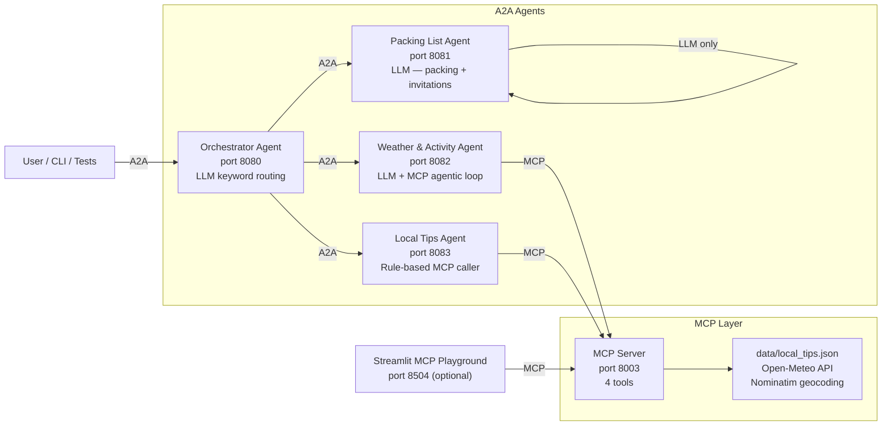
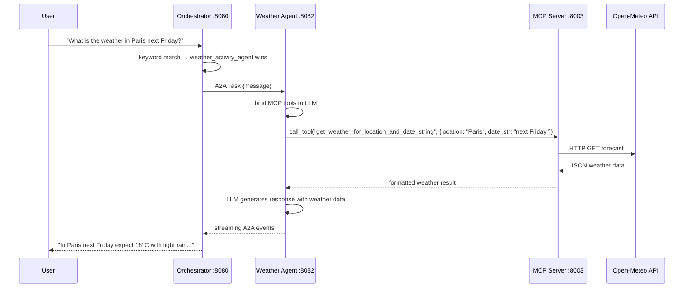

# Travel Activity Planner — Architecture

This document describes the components, data flow, and file structure of the Travel Activity Planner use case.

For system-wide architecture shared by both use cases, see [`docs/architecture.md`](../../../docs/architecture.md).

---

## Component Overview

---

## Agent Details

| Agent | Port | Style | Uses LLM | MCP Tools Used |
|-------|------|-------|----------|----------------|
| Orchestrator | 8080 | LLM routing | Yes (Azure OpenAI) | None |
| Packing List Agent | 8081 | LLM only | Yes (Azure OpenAI) | None |
| Weather & Activity Agent | 8082 | LLM + MCP loop | Yes (Azure OpenAI) | `get_weather_for_location_and_date_string`, `suggest_activities_for_location_and_date` |
| Local Tips Agent | 8083 | Rule-based | No | `get_local_tips_by_city` |

---

## MCP Tools

| Tool | Tags | Data Source | Description |
|------|------|-------------|-------------|
| `greet` | — | Static | Demo greeting |
| `get_weather_for_location_and_date_string` | weather | Open-Meteo API | Temperature, conditions for a location and date |
| `suggest_activities_for_location_and_date` | weather, activities | Open-Meteo API | Weather-aware activity suggestions |
| `get_local_tips_by_city` | local_tips | `data/local_tips.json` | Restaurants, culture, transport tips per city |

Supported `trip_type` values: `general`, `family`, `beach`, `cultural`, `adventure`, `romantic`  
Supported cities: Tel Aviv, Paris, Barcelona, Rome, London

---

## Request Flow — Weather Query

---

## File Map — Component to Code

| Component | Directory | Key Files |
|-----------|-----------|-----------|
| Orchestrator Agent | `a2a_agents/orchestrator_agent/` | `agent_logic.py` — routing; `agents_registry.json` — remote URLs |
| Packing List Agent | `a2a_agents/remote_agents/packing_list_agent/` | `agent_logic.py` — LLM packing/invitation prompts |
| Weather & Activity Agent | `a2a_agents/remote_agents/weather_activity_agent/` | `agent_logic.py` — LLM + MCP tool loop |
| Local Tips Agent | `a2a_agents/remote_agents/local_tips_agent/` | `agent_logic.py` — rule-based city parser |
| MCP Server | `mcp/` | `fastmcp_server.py` — tool definitions; `mcp_utils.py` — weather helpers |
| MCP Data | `mcp/data/` | `local_tips.json` — city tips |
| Shared infrastructure | `a2a_agents/` | `base_executor.py`, `server_factory.py`, `client.py` |
| Tests | `tests/` | `test_mcp.py`, `test_agents.py`, `test_local_tips.py`, `test_multi_turn.py` |
| UI | `ui/` | `mcp_playground.py` — Streamlit (port 8504) |

---

## External Dependencies

| Service | Used by | Required |
|---------|---------|---------|
| Azure OpenAI | Orchestrator, Packing List Agent, Weather & Activity Agent | Yes |
| Open-Meteo API | MCP Server (`get_weather_*` tools) | Yes — internet access required |
| Nominatim geocoding | MCP Server (`mcp_utils.py`) | Yes — internet access required |

The Local Tips Agent and its MCP tool (`get_local_tips_by_city`) are fully offline — they read from `data/local_tips.json`.

---

## Port Reference

| Service | Port | Start command |
|---------|------|---------------|
| MCP Server | 8003 | `python -m mcp.fastmcp_server` |
| Orchestrator Agent | 8080 | `python -m a2a_agents.orchestrator_agent` |
| Packing List Agent | 8081 | `python -m a2a_agents.remote_agents.packing_list_agent` |
| Weather & Activity Agent | 8082 | `python -m a2a_agents.remote_agents.weather_activity_agent` |
| Local Tips Agent | 8083 | `python -m a2a_agents.remote_agents.local_tips_agent` |
| Streamlit UI | 8504 | `streamlit run ui/mcp_playground.py --server.port 8504` |

All services start automatically via `.\start_all.ps1`.
